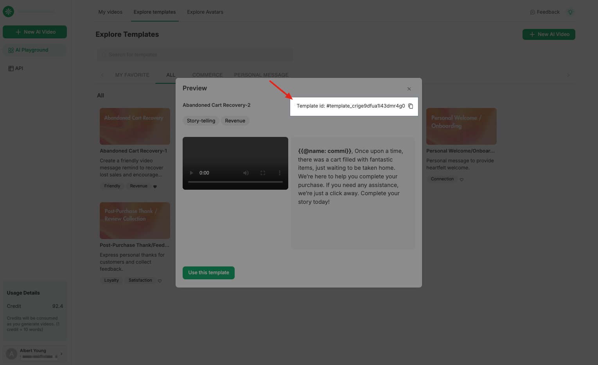
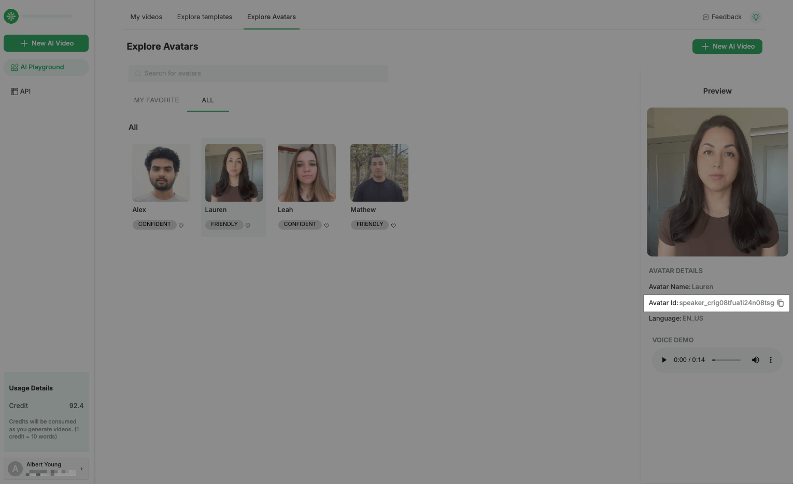
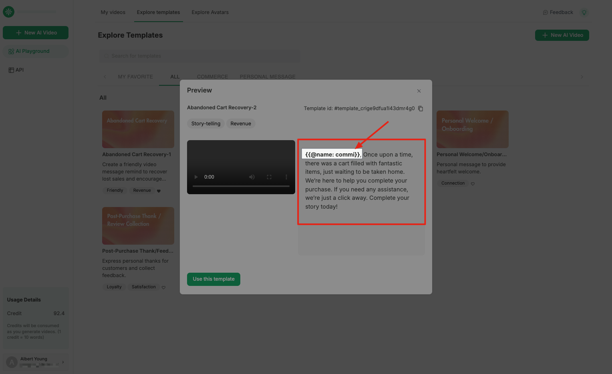

# Generate Personalized Videos At Scale

Here we provide API example to generate personalized video messages at scale.

Let's see how easy to generate bulk personalized video messages using API by just switching value of variable!

We take the "Abandoned Cart Recovery" use case as an example, to switch value to different names to create personal touch to different users.

- [Results](#results)
- [Example: How to generate personalized video at scale?](#example-how-to-generate-personalized-videos-at-scale)
    - [Overview](#overview)
    - [Step1: template_id](#step1-choose-the-video-template-based-on-your-use-cases-and-get-your-template_id)
    - [Step2: speaker_id](#step2-choose-the-speaker-speaks-in-your-video-and-get-your-speaker_id)
    - [Step3: customize variable](#step3-customize-variables-to-generate-personalized-videos-at-scale)
    - [Generation Result](#video-generation-result)

## Results

You can check your video generation results in API or in your video list page.

> Use API to generate and check the video status
- Generate personalize videos: [POST] - '/v1/videos'
- Check generation status: [GET] - '/v1/videos/{video_id}/status'

## [Example] How to Generate Personalized Videos At Scale?

### Overview
> In just 3 steps!

1. Choose the "Video Template" based on your use cases and get your 'template_id'

2. Choose the "Speaker" speaks in your video and get your 'speaker_id'

3. Customize Variables to generate personalized videos at scale

### Step1: Choose the "Video Template" based on your use cases and get your 'template_id'

We provide some personalized video templates in commerce and personal message use cases, for example, personal welcome message, onboarding, post-purchase thanks etc.

You can find templates here: https://video-generation.watiapp.io/ai-playground/video/explore-templates

And pick your video message template to get 'template_id'

### Step2: Choose the "Speaker" speaks in your video and get your 'speaker_id'

We provide several speakers that could speak in your videos, with diverse languages/tone, EN_GB, EN_UK, EN_INDIA...

You can find speakers here: https://video-generation.watiapp.io/ai-playground/video/explore-avatars

And pick your speaker to get 'speaker_id'

### Step3: Customize Variables to generate personalized videos at scale

You can customize the variables in video template, to generate bulk personalized video messages just by switching the value of the variable. 

For example: Hi {{ Name }}, ...
- Hi {{ Alex }}, ...
- Hi {{ Ben }}, ...
- Hi {{ Nancy }}, ...

### Video Generation Result

You can check the video generation status by our API, it will return you a 'video_id' and 'video_url' when the generation succeed.

