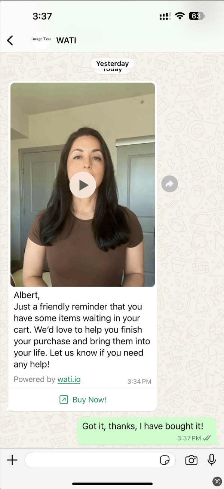

# Send WhatsApp Personalized Video Messages

Here we provide code example to send WhatsApp Personalized Video Messages via WATI.

Let's see how easy to send a personalized "Abandoned Cart Recovery" video messages on WhatsApp via WATI !

## ⚠️ Attention

> **Video Resource Public Issue**

If you want to send video messages on WhatsApp, your video will automatically publish to the public due to the requirement of the messaging platform policy. ( meaning everyone could reach your video through a video url end up with .mp4 ).

## Result

1. WhatsAPP video message

2. Track on WATI
(1) Team Inbox

(2) Broadcast Analysis

## Why send personalized video messages on WhatsApp?

> Video Message >> Text Message

Video message create much more open-rate and conversion of the business. 

> Personalized videos!

Personalized video means every video will customized by customers profile, for example, name etc.

So customers who have recieved your video message will feel warm-hearted and concerned from your attention, which helps a lot in improving customers' satisfaction, building trust and loyalty of customers.

> WhatsApp >> Email

As a well-knowned daily social platform over 2 billion users around the world, gaining more direct attention and build up more closer connection than other platform, which results in higher open-rate and higher conversion, helping business to connect with customers as soon as possible. 

## [Example]: How to send a personalized "Abandoned Cart Recovery" video messages?

### Overview
> In just 3 steps!
- Step1: Create WhatsAPP Video Message Template Using WATI
- Step2: Generate personalized videos and get the 'video_id'
- Step3: Send personalized videos at scale using message template

### Step1: Create WhatsAPP Video Message Template Using WATI

#### 1. New Template Message 

#### 2. Create a **Video Message Template**
- Enter Template name: "video_message_template"
- Choose template type: "Standard"
- Choose type of broadcast title: "Media" - "Video"
- Enter a variable to get your personalized video: "video_url"
- Type your template body script: add any content as you like (here we take the video script for the text content as an example)

- Add Sample Content
    - {{video_url}}: https://www.w3schools.com/html/movie.mp4
    - {{name}}: Albert

#### 3. Submit the template to approved by WhatsApp

- waiting to be approved

- after approval

### Step2: Generate personalized videos and get the 'video_id'

> There's 2 ways to get your generated video's 'video_id'.
You can get the 'video_id' from your already generated videos or generate new one.

#### 1. AI Playground

- Look up in 'My Video', click the video title you have generated and want to share.

- Copy the 'video_id' of the video

#### 2. API

Use API '/v1/videos' to list all the videos you have generated and select the target 'video_id'.

### Step3: Send personalized videos at scale using message template

> Use API '/v1/send/wati' to send whatsapp video message via wati.

Here's the resource requirements

#### 1. Commi: generate video
- **API_Key**: find here (https://video-generation.watiapp.io/service-api/settings)

- **API_Endpoint**: find here (https://video-generation.watiapp.io/service-api/references)

#### 2. WATI: broadcast video messages on WhatsAPP
- **WATI_API_AccessToken**: find here (wati api-doc page)

- **WATI_API_Endpoint**: find here (wati api-doc page)

- **WATI_Template_Name**: use the template name you have created ( example: video_message_template )

- **WATI_Broadcast_Name**: create broadcast name ( example: video_broadcast )

#### 3. Video Message
- **WATI_Template_Video_Variable_Name**: enter your variable to get your video in template ( example: video_url )

- **Generated_Video_Id**: enter the video_id of the video you want to share ( example: xxxx )

- **WhatsApp_Number**: enter the target contact you want to share your messages ( example: 9128382xxx )

- **Other Template Variable & Value**: enter other customize variables in wati template (example - 'name': 'name', 'value': 'Albert')

Here's the sending Results of API.

